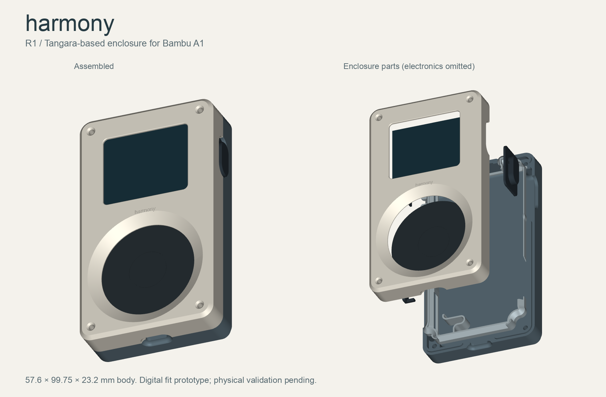

# Harmony R1 printable enclosure

Complete enclosure fit prototype for the proposed Tangara-based Harmony. Designed for a Bambu A1 with a 0.4 mm nozzle. Electronics must match the pinned Tangara mainboard and faceplate. This is not a case for the Olimex development board or the Adafruit 1.14-inch breakout.



Open [harmony-shells.3mf](print/harmony-shells.3mf) in Bambu Studio for the front and back. Open [harmony-small-parts.3mf](print/harmony-small-parts.3mf) for the fittings, cage, and cover. Start with [harmony-fit-test.3mf](print/harmony-fit-test.3mf). These are millimeter geometry files with parts placed on the bed. They contain no printer instructions. Select your A1 and filament, inspect the sliced preview, then print.

## Design and fit

The shell body is 57.6 mm wide, 99.75 mm tall, and 23.2 mm deep. Side controls extend beyond that width. The internal interface comes from Tangara's Rev-03b printing exports: 0.3 mm PCB clearance setting, 2.4 mm screw holes, and the upstream mating lip. The shell wall is nominally 2.5 mm. This is a compact, thick player rather than the thin final iPod Classic.

Harmony adds a 1 mm exterior reinforcement to the original rear floor, making the central floor 2 mm thick. The battery cavity stays unchanged. Both shells carry recessed Harmony lettering; the rear also has shallow grip grooves. The additional rear material recesses the original screw countersinks by 1 mm. Use the original screw lengths and a driver that reaches the recess.

The circular cover has a shallow center-ring groove and a matching 44.4 mm retaining pocket in the front shell. That pocket resolves an interference between the older cover model and the newer front-shell export.

The front and back have the original USB-C, headphone, side-button, hold-switch, and SD openings. The battery cage uses the upstream outer locating surfaces, with the spring preload removed and thin ties joining the guides outside the reference battery envelope. Secure the pack with removable battery pull-tab adhesive on the rear floor. The printed guides must not squeeze the pouch. A removable touch cover keeps the sensing surface replaceable. The front corner fasteners remain visible for service access.

All STL files are oriented for printing. STEP files preserve assembly coordinates and should not be sent to a slicer as a single fused object. [enclosure-assembly.step](cad/enclosure-assembly.step) includes the fitted enclosure and a reference lens. It omits the electronic assemblies, screws, and battery.

## Printed parts

| File | Quantity | Purpose |
| --- | --- | --- |
| `front.stl` | 1 | Front shell with screen and wheel openings |
| `back.stl` | 1 | Reinforced rear shell |
| `touch-cover.stl` | 1 | Continuous insulating disk over ring and center sensor |
| `button-upper.stl` | 1 | Upper side-button cap |
| `button-lower.stl` | 1 | Lower side-button cap |
| `hold-switch.stl` | 1 | Captive hold-switch slider |
| `sd-caddy.stl` | 1 | Removable SD-card fitting |
| `battery-cage.stl` | 1 | Passive battery guides derived from the batch-1 cage |
| `fit-front.stl`, `fit-back.stl` | 1 each | Corner samples with mating lip and screw access |

The shell and most fittings derive from Cool Tech Zone's open Tangara design. This package contains original CAD sources, editable Harmony modifications, and regenerated exports. It is not an independently designed electrical or mechanical platform. See [sources.json](source/sources.json) for exact source paths and [LICENSE](source/LICENSE) for CERN-OHL-S-2.0.

## A1 settings and first print

Use ordinary PLA for fit tests. PETG is a candidate for the carry case after fit validation. Avoid carbon-filled, metallic, or conductive material around the touch sensor and antenna. The preview's suggested finish is a warm-white front, gray back, and charcoal controls. Each part can print in one color; AMS is optional.

For the shells, start with the A1 0.4 mm nozzle profile, 0.16 mm layers, four walls, five top/bottom layers, and 15% gyroid infill. Keep the supplied exterior-face-down orientation. Start with automatic supports and review the screen lip, ports, and internal ledges; remove supports carefully before assembly. Do not assume a mesh validation proves support-free printability. Use a smooth plate if you want smooth exterior faces.

Print the small fittings at 0.12 mm layers. The new printed touch cover is 43.9 mm in diameter and 0.6 mm thick, with a 0.12 mm deep center-ring groove. Check that the slicer produces approximately 0.6 mm of solid plastic, with no sparse infill or omitted layers. Print it separately on a smooth plate and measure the result. Its touch sensitivity is untested in PLA or PETG. A 0.6 mm insulating FR4 cover cut to this revision's circular outline is the fallback if the printed disk is unreliable; check any stock cover's outline before using it; a printed disk does not replace the copper electrodes on the faceplate PCB.

The supplied mating-lip gap is only the upstream nominal clearance. Print the fit pair, clean the brim and first-layer flare, and join them by hand. If they require force, correct first-layer expansion or the lip clearance before printing the whole case. Do not scale the entire model: that also moves the PCB holes and ports. Small internal ledges make this fit test more useful than a generic printer cube.

Bambu Studio 02.08.02.61 successfully sliced all three plates with the A1 profiles and PLA Basic. Estimated time/material: shells 118 minutes / 38.48 g; small parts 29 minutes / 4.90 g; fit pair 20 minutes / 2.51 g. These are slicer estimates, including preparation, not measured prints. See [slicer-validation.json](slicer-validation.json) for input hashes and the saved settings under `verification/slicer-settings/`.

## Parts that are not printed

**Sourcing correction, September 13:** the upstream battery BOM combines mismatched identifiers. Read the [current shopping list](../../hardware/procurement/README.md) before buying a pack or printing the final rear shell. A sourced battery may require a cage/rear-shell revision; the existing CAD has not been changed by the sourcing review.

| Part | Specification or source |
| --- | --- |
| Mainboard and faceplate | Matched Tangara PCB assemblies, source revision pinned in `hardware/tangara-reference/source-lock.json` |
| Display | Faceplate-compatible EastRising ER-TFT018-4; confirm actual mechanical envelope against the older ER-TFT018-2 case reference before purchase |
| Screen lens | Clear plastic, 39.6 × 34.4 × 0.5 mm, secured with thin perimeter tape clear of the display. The thinner sheet clears the newer shell; trim/test without forcing the LCD |
| Battery | Protected 1S LiPo with matching three-wire connector and temperature sensing; physically match the batch-1 cage |
| Battery envelope | CAD pack envelope approximately 44.3 × 72.05 × 5.9 mm; cable/connector need additional space. Measure the sourced pack, including protection board and seams |
| Interconnect | 15-position, 0.5 mm pitch FFC; Samtec FJH-15-R-03.00-4 from upstream BOM |
| Standoffs | 4 × M2, 6 mm, Wurth 970060244 or mechanically identical |
| Front screws | 4 × M2 × 14 mm countersunk |
| Rear screws | 4 × M2 × 8 mm countersunk, as upstream |
| Haptic motor | Faceplate-compatible upstream part, included in the PCBA/final-assembly quote |
| Storage | SD card supported by the selected firmware; use a full-size SD adapter if choosing microSD |

The lens, electronics, fasteners, and battery cannot be replaced with printed plastic. The upstream BOM contains some older case-directory names and unresolved sourcing entries. Treat it as a reference and reconcile it against the chosen board revision before ordering.

## Assembly

Follow the [manufacturer's assembly guide](https://cooltech.zone/tangara/docs/assembly/) with power disconnected. Check the bare shell fit first. Seat the hold slider and side caps in their pockets, install the mainboard and standoffs, and connect the faceplate FFC in its specified orientation. Lay the insulating wheel cover over its electrodes and seat the lens without pressing on the display. Fit the front with its longer screws.

Install the matching battery cage and pack with removable pull-tab battery adhesive. Route the cable clear of the seam, screws, and switch travel. Verify connector polarity and temperature-sense wiring against the mainboard schematic. The cell must lie without compression; a case that needs screw force to close is a failed fit. Fit the back with the shorter screws and tighten gently into the metal standoffs. Check that both buttons return freely and the hold slider completes its travel. Install the SD caddy and test removal.

The case has no gasket, water-resistance claim, or validated drop rating. Check touch response, charging temperature, and Bluetooth reception in the assembled enclosure. The printed touch cover and physical tolerances are the first experiments, not settled properties.

## Rebuild and validation

From the Harmony2 root:

```sh
uv run --with cadquery==2.8.0 --with trimesh --with matplotlib enclosure/harmony-r1/build.py
```

The generator checks solid validity, positive volume, closed meshes, consistent winding, print bounds, and pairwise part intersections. Read [validation.json](validation.json) for results and any remaining interference. The checks do not simulate material shrinkage, switch travel under load, touch sensitivity, RF reception, battery safety, or print supports. Physical validation has not occurred.

The exact STEP inputs and original FreeCAD document are included under `source/`. The upstream notes warn that the original parametric FreeCAD file requires 0.21.x and may not recompute correctly in 1.x. Harmony's script uses the STEP solids and cached shape snapshots, so regeneration does not depend on recomputing that document. [build.py](build.py) is the editable source for this revision's modifications.

## Cross-references

- [Approach reassessment](../../docs/Harmony-2026-reassessment.md)
- [Electronics reference](../../hardware/tangara-reference/README.md)
- HARMONY-8
